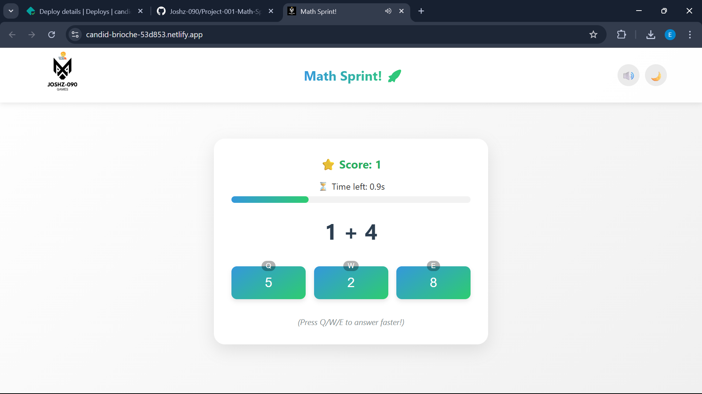
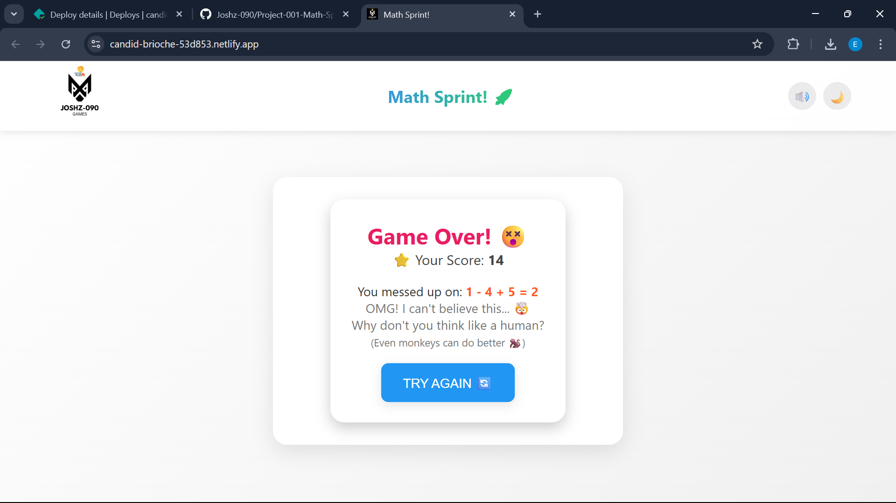

# 🚀 Math Sprint! 🧠

A fast-paced arithmetic challenge game designed to sharpen mental math skills through timed problem-solving.

---

## 🧭 Table of Contents
- [✨ Features](#features)
- [🎯 Gameplay](#gameplay)
- [📦 Installation](#installation)
- [🛠️ Technologies](#technologies)
- [🗺️ Roadmap](#roadmap)
- [🔗 Demo](#demo)
- [🤝 Contributing](#contributing)
- [📜 License](#license)

---

## ✨ Features

### 🧠 Core Mechanics
- **Adaptive Difficulty**: Progress from basic addition to complex mixed operations
- **⏳ Time Pressure**: 3-second response window with visual countdown
- **📈 Level Progression**: Unlock advanced problems every 10 points
- **✅ Instant Feedback**: Visual and audio cues for responses

### 🎨 User Experience
- **🌗 Dual Theme System**: Toggle between light/dark modes
- **💾 Persistent Settings**: Remembers user preferences
- **📱 Cross-Platform**: Fully responsive mobile/desktop design
- **🔊 Audio Controls**: Optional sound effects

---

## 🎯 Gameplay

### 💻 Desktop Controls
1. Launch game with **START GAME** button
2. Answer using:
   - 🖱️ Mouse clicks **OR**
   - ⌨️ Keyboard shortcuts (Q/W/E)
3. Advance through levels by scoring points

### 📱 Mobile Experience
- Touch-optimized interface
- Larger tap targets
- Simplified visual feedback

---

## 🛠️ Technologies

**Frontend**:
- 🧩 HTML5 Semantic Markup  
- 🎨 CSS3 Animations and Flexbox/Grid  
- ⚡ Vanilla JavaScript (ES6+)  

**Key APIs**:
- 🔉 Web Audio API for sound effects  
- 💽 localStorage for state persistence

---

## 🗺️ Roadmap

Planned Enhancements:
- [ ] 🏆 High score leaderboard  
- [ ] ❌➗ Multiplication/division problems  
- [ ] ⏱️ Progressive time adjustments  
- [ ] 📊 Performance analytics dashboard  

---

## 🔗 Demo

Experience the game live:  
👉 [Math Sprint Web Demo](https://candid-brioche-53d853.netlify.app/)

  
  

 

  

---

## 🤝 Contributing

We welcome contributions! Please:
1. 🍴 Fork the repository
2. 🌿 Create your feature branch
3. 📬 Submit a pull request

---

## 📜 License

Distributed under the MIT License. See `LICENSE` for more information.

---

### 👨‍💻 Developer: Eyasu Zerihun  
📧 **Contact**: [eyasuzerihun80@gmail.com](mailto:eyasuzerihun80@gmail.com)  
🌐 **Portfolio**: [joshz-090.github.io/my-portfolio](https://joshz-090.github.io/my-portfolio/)
